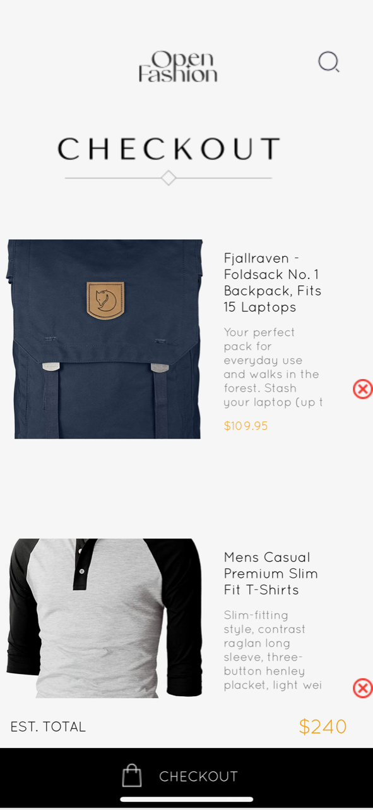

# rn-assignment7-11105718
## ID: 11105718

### STORAGE 
AsyncStorage was used to persist data in this application.
I used methods such as getAllkeys and removeItem to retrieve and delete items stored on the device.

### API 
A fake API store was used to retrieve all the data used in this project. Mathods such as fetch was used to get data from the API.
Promises were dealt with using .then() method.

## IMAGES OF THE ASSIGNMENT

### HOME SCREEN

### CART SCREEN

### DRAWER NAVIGATION

